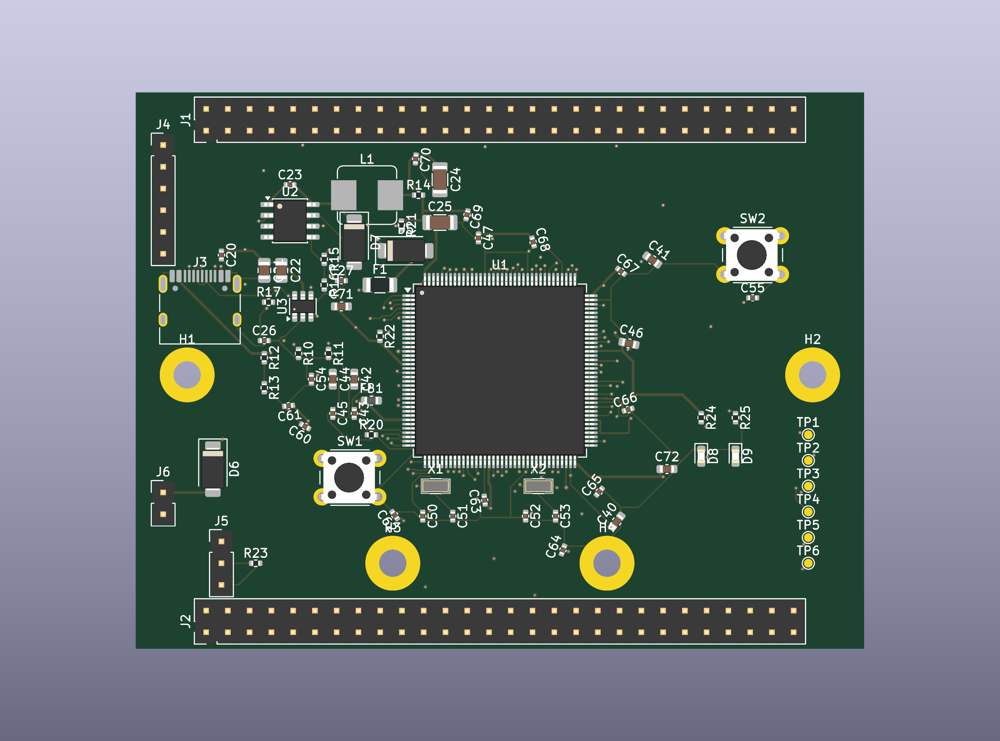

# STM32H743ZIT6 核心板 · 全自动 EDA 设计流水线

> 规格书驱动、脚本自动生成的 STM32H743ZIT6 最小系统核心板：原理图 → PCB 布局布线 → DRC/语义门禁 → 制造文件。当前处于自动 EDA 流程整改与层策略实验阶段。



## 项目是什么

一块 **STM32H743ZIT6（LQFP144, Cortex-M7 @ 480MHz）最小系统核心板**，以及生成它的**自动化 EDA 流水线**：

- 85×65mm 四层板，USB-C 供电，TPS54331 DCDC，8MHz HSE + 32.768kHz LSE，SWD + USB（DFU），双排 2×28 引出 GPIO
- 原理图、网表、PCB、DRC、Gerber 由 Python/KiCad/Freerouting 流水线生成；人工负责规格决策、规则审查与最终视觉复核
- 附带 [方法论与流程记录](doc/方法论与流程记录.md) 与本地 Agent 执行计划，记录自动 EDA 的真源链、门禁和实验结果

## 仓库结构

```text
├── STM32H743ZIT6_核心板设计规格书.md   # 设计规格（人审输入）
├── doc/                              # 参考资料、方法论、Agent 执行计划
├── kicad/                            # EDA 产物与当前 build_status
└── tools/                            # 生成、布线编排与独立门禁脚本
```

关键脚本：

- `tools/gen_schematic.py`：生成 schematic，并强制从当前 schematic 重导 `.net`
- `tools/check_netlist.py`：独立网表语义门禁
- `tools/gen_pcb.py`：PCB/DSN 生成器
- `tools/pipeline_pcb.py`：DSN 分类、Freerouting、回写、DRC 与制造文件编排
- `tools/check_layer_policy.py`：内层设计意图门禁
- `tools/check_schematic_parity.py`：schematic/PCB 语义 parity 门禁
- `tools/release_gate.py`：artifact lineage + netlist + layer policy + DRC + parity 的最终发布门禁

## 快速复现

环境：KiCad 10（含自带 Python）、Python 3.10+、Freerouting v2.4.x。

```bash
# 1. 原理图 + 当前网表
python tools/gen_schematic.py
python tools/check_netlist.py

# 2. PCB / DSN
"<KiCad>/bin/python.exe" tools/gen_pcb.py
python tools/pipeline_pcb.py dsn

# 3. 自动布线
python tools/pipeline_pcb.py route --max-passes 5

# 4. SES 回写 / zones / DRC
"<KiCad>/bin/python.exe" tools/finish_pcb.py
python tools/pipeline_pcb.py drc

# 5. 完整发布门禁
python tools/release_gate.py

# 6. 制造文件：pipeline 会再次强制执行 release gate，失败则禁止导出
python tools/pipeline_pcb.py fab
```

## 设计依据

主要参考：ST AN4938、DS12110、ES0392、官方 NUCLEO-H743ZI2 参考设计，以及 TI TPS54331 数据手册；本地参考登记见 `doc/`。

## 当前状态

> **CURRENT STATUS: WIP / NOT FAB-READY**
>
> 当前正在验证四层板层策略与自动布线可收敛性。只有 `tools/release_gate.py` **PASS** 才允许生成新的制造文件。

当前已确认：

- schematic → netlist artifact lineage 已改为强制重导；TPS54331 `SS -> C28 10nF -> GND` 已进入正式真源链；
- In1.Cu 为 GND-only 硬约束；Experiment B 对 In2.Cu 采用 `+3V3 + 显式普通 GPIO 白名单`，敏感/语义网络默认禁止进入；
- 当前签入的 PCB/DRC 仍是失败实验产物，`kicad/build_status.json` 为事实状态文件；
- 上一轮 Experiment B 曾误把普通信号按 0.50mm 电源线宽路由，因此其 44/54 未连通数据**不能作为层策略优劣结论**；需由本地 Agent 在 0.20mm signal width 下重跑；
- 当前仓库不应把已有 `gerbers/` 视作可投板 Release Candidate。

关于当前 clearance：报告中存在约 0.10–0.149mm 的项目；其中低于 0.127mm 的项目不能描述为满足 0.127mm 工艺下限，最终必须以选定板厂/工艺规则和 Release Gate 为准。

## 许可

代码与设计文件以 [MIT](LICENSE) 发布。`doc/` 内的 ST/TI 版权文档（数据手册/应用笔记/官方原理图）版权归原作者所有，仅作本地参考，请遵循原厂商条款使用。
